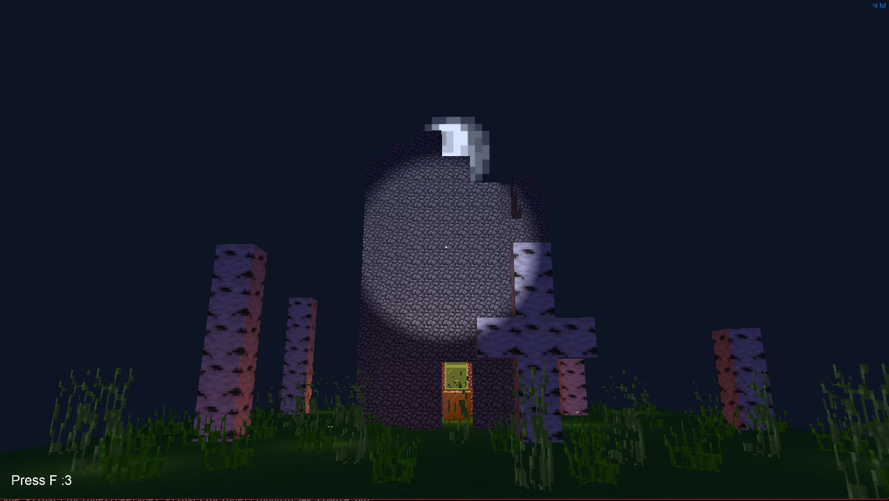
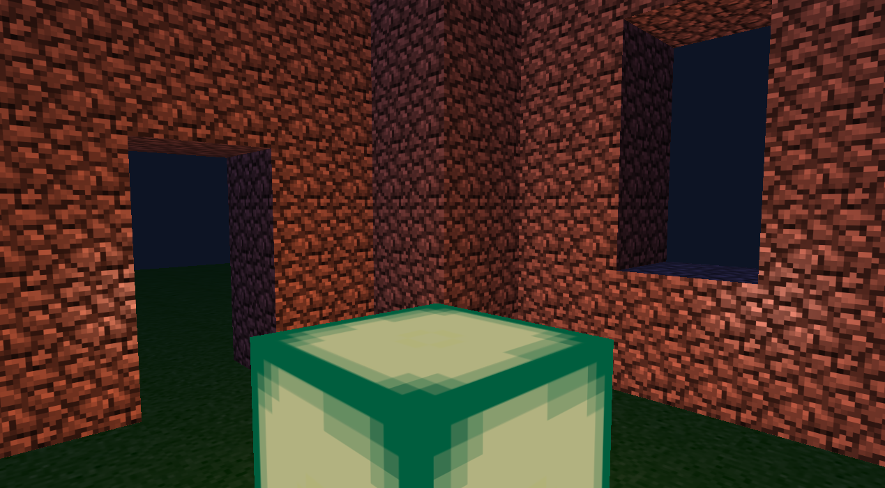
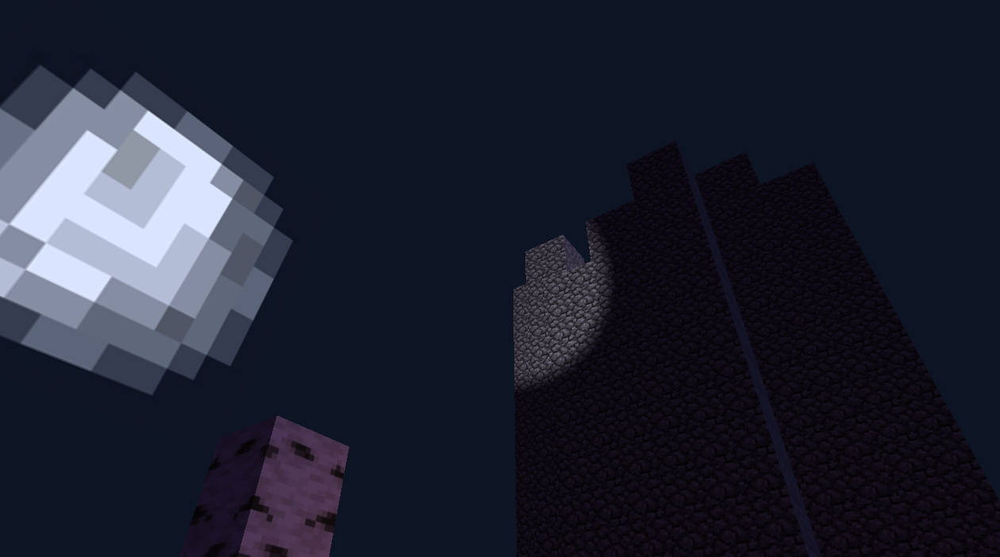
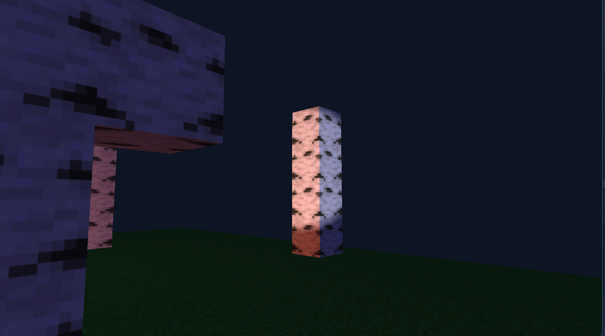

# Learning Lighting in OpenGL

This project helped me to learn the basics of lighting in OpenGL, from just having a source light to having multiple light casters and different types of lights. It was a ton of fun making everything come to light.

## Overview

I managed to render an eerie minecraft alpha-style scene, with a broken tower, naked birch trees and a giant moon, representing the ARG or creepypasta themed minecraft content. 

## Demo Video

[](https://www.youtube.com/watch?v=a9uOaJTj4tk)

(press on the thumbnail)

## Screenshots







## Tech Stack

1. Language: C++
2. Graphics API: OpenGL (Version 3.3 Core)
3. Libraries: GLFW, GLAD, GLM, stb_image.h and freetype2

## Controls

1. `W, A, S, D` to move around
2. `Mouse` to look around
3. `F` for flashlight
4. `ESC` to close the render

# How to run

## Pre-built Executables

I have provided the setup files for both windows and linux in the releases section, so you can download the zip files for your system and run the specific executable. (MAKE SURE THAT THE SHADERS AND ASSETS FOLDER ARE IN THE SAME LOCATION AS THE EXECUTABLE)

## Local Setup (Compile) and Installation

**IF THE PRE-BUILD EXECUTABLES FROM THE RELEASES SECTION DO NOT WORK FOR YOU (I.E. BUGGING OUT/CRASHING/NOT WORKING/ETC...), ONLY THEN TRY TO COMPILE IT LOCALLY, ELSE JUST RUN THE PRE-BUILT FILES**
To run this project locally, you will need a C++ compiler (`g++`/`gcc`) that supports C++23, `make`, and `pkg-config`. You also need to install the required dependencies: GLFW, FreeType2, and GLM. 

### Prerequisites

#### Windows (using MSYS2)
If you are on Windows, it is highly recommended to use [MSYS2](https://www.msys2.org/) (specifically the UCRT64 environment) to install the dependencies and compile the code. 
Go to the MSYS2 website and install the MSYS2 compiler for your pc. There should be a [tutorial](https://www.msys2.org/) on how to install the compiler.

Open your MSYS2 UCRT64 terminal and run:

```bash
pacman -S mingw-w64-ucrt-x86_64-gcc mingw-w64-ucrt-x86_64-make mingw-w64-ucrt-x86_64-pkgconf mingw-w64-ucrt-x86_64-glfw mingw-w64-ucrt-x86_64-freetype mingw-w64-ucrt-x86_64-glm
```

#### Ubuntu/Debian
```bash
sudo apt update
sudo apt install build-essential pkg-config libglfw3-dev libfreetype6-dev libglm-dev
```

#### Arch
```bash
sudo pacman -S base-devel pkgconf glfw-wayland freetype2 glm
# Use glfw-x11 instead of glfw-wayland if you are on an X11 session
```

### Building the Project
Once you have cloned the repository and installed the prerequisites, navigate to the root directory of the project in your terminal and build it using:
(Note: If you are on Windows then use the MSYS2 UCRT64 compiler as it better for it)

```bash
make
```

### Running the Program
After a successful build, you can run the generated executable.

#### Windows
```bash
.\src\minecraft_scene.exe
```

#### Linux
```bash
./src/minecraft_scene
```

### Cleaning up build files
If you want to re-compile the program or delete the executables, run
```bash
make clean
```

